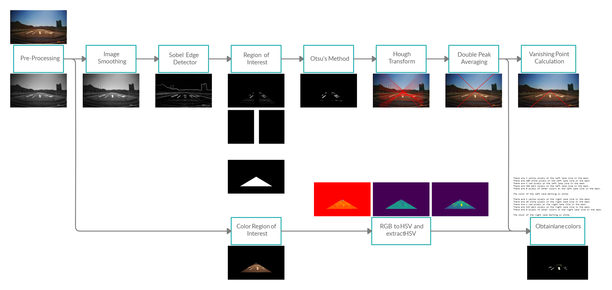

# Lane_F20


Purdue University Vertically Integrated Projects

Image Processing and Analysis: Professor Edward J. Delp, Professor Carla Zoltowski

Lane Detection Team: Pranav Jagada, Tharm Lertviwatkul, Louis Liu, Ben Sukboontip, Rohit Tokala


[Confluence page][]

[Research Expo Presentation][]

[Final paper][final paper]


Abstract: *Lane detection is an integral part of any autonomous driving system. The most popular methods of lane detection rely on machine learning. The purpose of this project is to accurately detect lanes and their color without using machine learning principles. Specifically, we take images from the car’s dashcam and detect the left and right lane markings of the lane the car is in. The main method used to extract the lanes from the image is the Hough transform, which is a popular robust method for detecting lines in any image. To further improve the results, we employ various pre-processing and post-processing methods. A Sobel edge detector is used to extract the edges in the image before the region of interest is selected. We use Otsu’s thresholding to further extract the most prominent edges in the region of interest. Further masking is used to remove irrelevant information such as arrow marks on the road. After the Hough transform is applied, methods such as double peak averaging and a vanishing point calculation filter the output to the most essential information. To detect the color of the lanes, the RGB (Red, Green, Blue) image is converted to an HSV (Hue, Saturation, Value) image. The result is a process that, given a dashcam image, will detect straight lanes and their colors in perfect to moderate lighting conditions.*


## Contact Information

| Author | Email |
| ------ | ------ |
| Pranav Jagada | [pjagada@purdue.edu][pemail] |
| Tharm Lertviwatkul | [jlertviw@purdue.edu][temail] |
| Louis Liu | [liu2881@purdue.edu][lemail] |
| Ben Sukboontip | [bsukboon@purdue.edu][bemail] |
| Rohit Tokala | [rtokala@purdue.edu][remail] |

## Requirements

 - Python (terminal or IDE)
 - Python libraries:
    - cv2
    - numpy
    - PIL
    - matplotlib
    - math
    - os
    - seaborn
    - pandas
    - sklearn

## File Descriptions

| File name | Type | Description|
| ------ | ------ | ------ |
| EntireProcess.ipynb | execute | Run this file to see all the outputs in a notebook format |
|EntireProcess.py | execute | Run this file in an IDE or terminal to see all the outputs |
| ColorDetection.py | module | Contains functions for color detection |
| EdgeDetection.py | module | Contains functions for image smoothing and Sobel edge detection |
| HoughTransform.py | module | Contains functions for Hough Transform |
| PostProcessing.py | module | Contains functions for double peak averaging |
| Preprocessing.py | module | Contains functions for image resizing, grayscale conversion, and masking |
| Visualization.py | module | Contains functions for visualizing overlaid calculated lines on resized image |
| block_diagram.png | block diagram | Shows the pipeline of the process |
| Sample images/ | dataset | Contains images to use as input |

## Block Diagram


This block diagram shows the pipeline of the process from the input (sample image) to the two outputs: two lane lines with the vanishing point and the color of each lane.

## Execution

### Notebook (EntireProcess.ipynb)
- Restart and run the entire kernel
- There will be a prompt for an input image
- Enter just the name of the image with the file extension but without the directory
- For example, type in "lane_sample1.jpeg" without the quotation marks

### Python file (EntireProcess.py)
Run this:
```sh
$ EntireProcess.py
```
Enter just the name of the image with the file extension but without the directory. For example, type in "lane_sample1.jpeg" without the quotation marks. All the images will show up one by one and the lane colors will be printed.

## Input images

| File | Notes |
| ------ | ------ |
|lane_sample1.jpeg| Jiqing Expressway Dataset image with tunnel |
| yellow_lane_1.jpeg | Contains a yellow lane |
| yellow_lane_2.jpg | Contains a yellow lane |
| dark_image.jpg | Average brightness is much lower than usual |

   [Confluence page]: <https://wiki.itap.purdue.edu/display/wlxls5c201710/Lane+Detection+Team
   [Research Expo Presentation]: <https://youtu.be/nQXoo_AVG88
   [final paper]: <>
   [pemail]: <mailto:pjagada@purdue.edu
   [temail]: <mailto:jlertviw@purdue.edu
   [lemail]: <mailto:liu2881@purdue.edu
   [bemail]: <mailto:bsukboon@purdue.edu
   [remail]: <mailto:rtokala@purdue.edu
